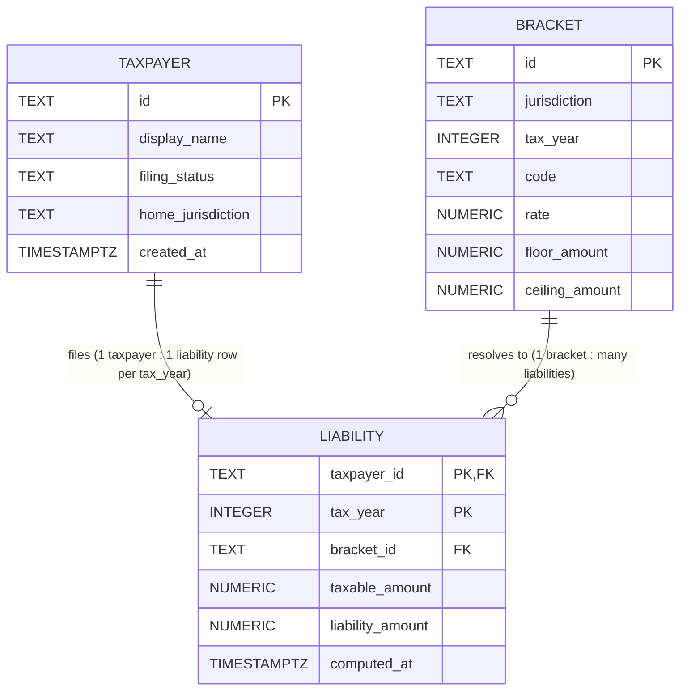

# Week 2 Day 1 — Postgres Schema, Constraints & Transactional Seed

Translates the Week 1 `TaxBracket` / `BracketResolver` domain into a durable
Postgres schema: `db/V1__schema.sql` (DDL), `db/V2__seed.sql` (transactional
seed + intentional-failure test), `db/verify.sql` (verification SELECTs).

## ER Diagram



`TAXPAYER (1) -- (0..1 per tax_year) LIABILITY`: a taxpayer may have zero or
one computed liability row per tax year (enforced by `LIABILITY`'s composite
primary key `(taxpayer_id, tax_year)`), and any number across different
years — modelled here as 1-to-many across the full table, 1-to-1 within a
single `tax_year`.

`BRACKET (1) -- (0..many) LIABILITY`: a single bracket can be the resolved
bracket for many liability rows (many taxpayers can land in the same
bracket); a liability always resolves to exactly one bracket.

## Schema decisions

- **`taxcalc.taxpayer`** models a taxpayer/filing identity — the anchor
  entity every `IncomeEvent` and `Deduction` in the Week 1 domain points at
  via `taxpayerId`. `filing_status` is constrained to the closed set of IRS
  filing statuses with a `CHECK`, not a native `ENUM`, since altering an
  `ENUM` later is a migration headache. `id` is `TEXT` (not `SERIAL`) so it
  can carry a synthetic id like `tp-2026-0001` without a database round-trip.

- **`taxcalc.bracket`** is the durable form of the Week 1 `TaxBracket`
  record (`id`, `jurisdiction`, `rate`, `floor`, `ceiling`), extended with
  `tax_year` and `code` so brackets are addressable by the natural key a
  rules author would type: `(jurisdiction, tax_year, code)`, enforced with
  `UNIQUE`. `rate` is `NUMERIC(5,4)` rather than `NUMERIC(12,2)` because it
  is a fraction (0–1), not a currency amount — the money-scale rule applies
  to `floor_amount`/`ceiling_amount`, not to rates. `ceiling_amount` is the
  only nullable column in the schema, mirroring `TaxBracket`'s nullable
  `ceiling` component (`null` = unbounded top bracket); every other column
  is `NOT NULL`.

- **`taxcalc.liability`** models one computed liability per taxpayer per
  tax year — the composite primary key `(taxpayer_id, tax_year)` enforces
  that invariant directly instead of re-checking it in application code.
  `taxpayer_id` cascades on delete (`ON DELETE CASCADE`) because a
  liability is strictly owned by its taxpayer and should not outlive it.
  `bracket_id` restricts on delete (`ON DELETE RESTRICT`) because
  `taxcalc.bracket` is a reference table — a bracket a stored liability
  points to must not be silently orphaned by deleting the bracket out from
  under it.

## Local run

Recreate the schema and seed from a clean Postgres 16 container:

```bash
docker run --name uptimecrew-pg \
  -e POSTGRES_PASSWORD=devpass \
  -p 5432:5432 \
  -d postgres:16

psql -h localhost -U postgres -f db/V1__schema.sql
psql -h localhost -U postgres -f db/V2__seed.sql
psql -h localhost -U postgres -f db/verify.sql
```

To re-run from scratch against an existing database, drop the schema first:

```bash
psql -h localhost -U postgres -c "DROP SCHEMA IF EXISTS taxcalc CASCADE;"
```

## Trade-offs

- **Composite PK on `liability` vs. a surrogate `id`.** A surrogate `id`
  would need an additional `UNIQUE (taxpayer_id, tax_year)` constraint to
  express the same "one liability per taxpayer per year" rule, plus an
  extra column nothing else references. The composite key `(taxpayer_id,
  tax_year)` expresses that invariant as the primary key itself and is
  exactly the pair every query joins/filters on, so it was chosen over a
  surrogate id.

- **`ON DELETE CASCADE` (taxpayer→liability) vs. `RESTRICT`
  (bracket→liability).** These are deliberately asymmetric. A taxpayer and
  their liabilities are a strict parent/child pair — deleting the taxpayer
  should take their computed liabilities with it, so `CASCADE` was chosen.
  A bracket, by contrast, is shared reference data that many liabilities
  point to; deleting a bracket that historical liabilities still resolved
  to would silently orphan those rows' explanation of how they were
  computed, so `RESTRICT` was chosen to force an explicit decision (e.g.
  reassign or archive the liabilities first) instead of a silent cascade.
